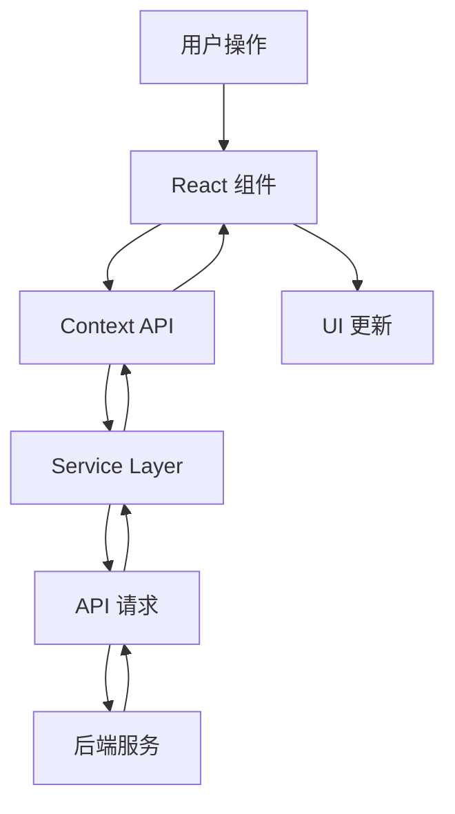
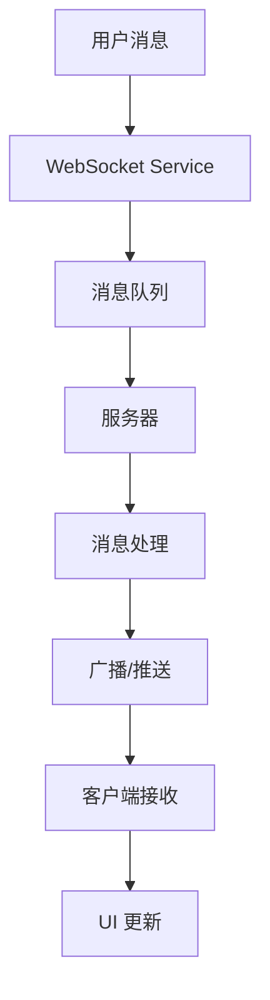

# 架构设计文档

## 系统架构

### 整体架构

AI Chat Web 采用前后端分离的微服务架构，主要包含以下部分：

- 前端应用（React SPA）
- 后端服务（Node.js + Express）
- 数据库服务（MongoDB）
- WebSocket 服务
- 支付服务
- AI 模型服务

### 技术选型

#### 前端技术栈

- **核心框架**: React 18
  - 使用最新的 React 特性
  - 基于 Hooks 的函数式组件
  - 响应式设计

- **UI 框架**: Material UI
  - 现代化的 UI 组件
  - 主题定制
  - 响应式布局

- **样式解决方案**: Tailwind CSS
  - 原子化 CSS
  - 高度可定制
  - 按需加载

- **状态管理**: React Context + Hooks
  - 轻量级状态管理
  - 易于维护
  - 适合中小规模应用

#### 后端技术栈

- **服务框架**: Node.js + Express
  - 高性能异步 I/O
  - 丰富的中间件生态
  - 易于扩展

- **数据库**: MongoDB
  - 文档型数据库
  - 灵活的数据模型
  - 高性能查询

- **实时通信**: WebSocket
  - 全双工通信
  - 低延迟
  - 实时推送

### 模块设计

#### 服务层设计

1. **AI 服务 (services/ai/)**
   - 配置管理 (config.js)
   - 缓存管理 (cache.js)
   - 消息处理 (messageHandler.js)
   - API 请求处理 (apiHandler.js)
   - 统一服务接口 (service.js)

2. **聊天服务 (services/chat/)**
   - 配置管理 (config.js)
   - 存储管理 (storage.js)
   - 导出工具 (exporter.js)
   - 统一服务接口 (service.js)

3. **数据库服务 (services/database/)**
   - 配置管理 (config.js)
   - 连接管理 (connection.js)
   - 错误处理 (errorHandler.js)
   - 查询管理 (queryManager.js)
   - 统一服务接口 (service.js)

4. **支付服务 (services/payment/)**
   - 核心功能 (core.js)
   - 微信支付 (wechat.js)
   - 支付宝支付 (alipay.js)
   - 计费服务 (billing.js)
   - 工具函数 (utils.js)

5. **WebSocket 服务 (services/websocket/)**
   - 配置管理 (config.js)
   - 错误处理 (errorHandler.js)
   - 消息队列 (messageQueue.js)
   - 统一服务接口 (service.js)

### 数据流设计

#### 前端数据流

#### WebSocket 数据流

### 安全设计

1. **认证与授权**
   - JWT 令牌认证
   - 角色基础访问控制
   - API 密钥管理

2. **数据安全**
   - HTTPS 传输加密
   - 数据库加密存储
   - 敏感信息脱敏

3. **接口安全**
   - 请求签名验证
   - 频率限制
   - CORS 配置

### 扩展性设计

1. **模块化设计**
   - 高内聚低耦合
   - 插件化架构
   - 统一接口规范

2. **可伸缩性**
   - 水平扩展支持
   - 负载均衡
   - 缓存机制

3. **可维护性**
   - 统一的错误处理
   - 完善的日志系统
   - 监控告警机制

## 部署架构

### 开发环境

- 本地开发服务器
- 本地 MongoDB
- 测试用 AI 模型

### 测试环境

- 测试服务器
- MongoDB Atlas (开发集群)
- 测试 AI 模型 API

### 生产环境

- Vercel 部署
- MongoDB Atlas (生产集群)
- 生产 AI 模型 API
- CDN 加速 